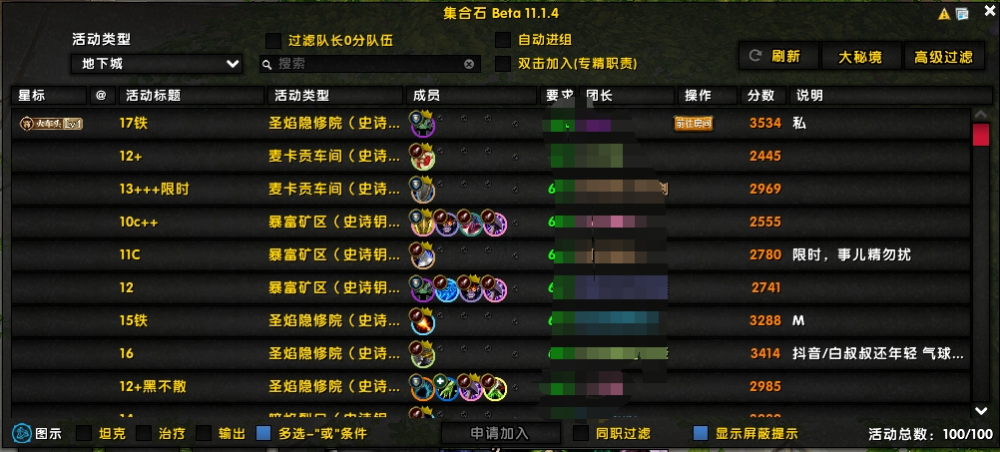
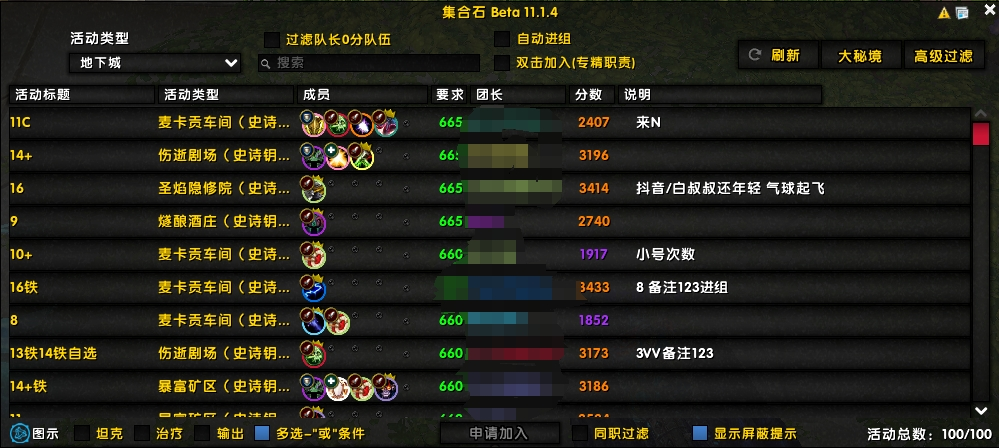

# This project is only for personal use and is not intended for commercial purposes.

## What is this project?
* use a simple way to remove unnecessary files from a plugin 

## Showcase

what the original plugin looks like


what the plugin looks like after removing unnecessary files



## How to use
1. ./MSSlim --path <the plugin folder> 
2. then just wait for the program to finish

or just modified the app.bat 
```bat
MSSlim.exe --path "Input your plugin folder here"
pause
```